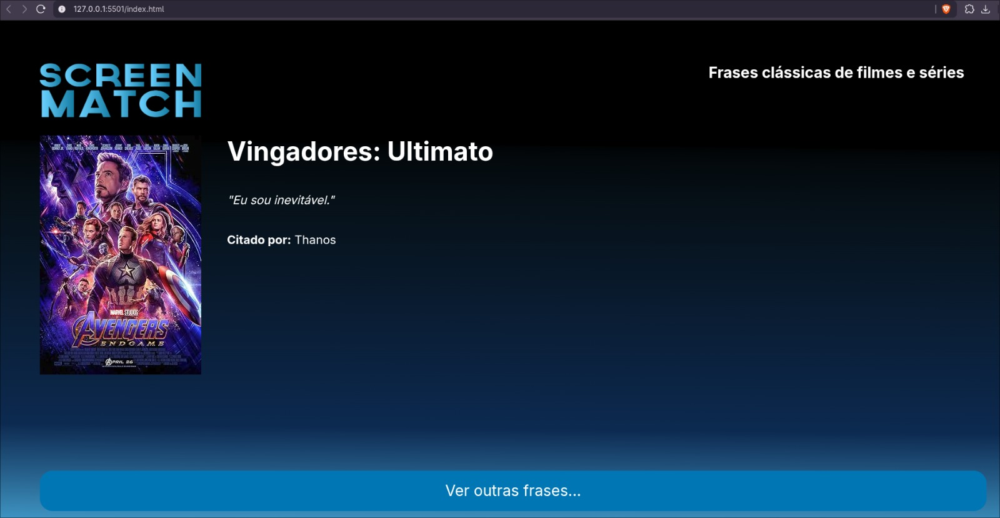

# 🎬 API Poster Movies


Projeto desenvolvido com foco em praticar conceitos de backend com **Spring Boot** e integração entre frontend e backend via requisições HTTP.

> ⚠️ **Observação:** Este repositório contém **apenas o backend**. O frontend não será incluído em conjunto, pois o objetivo principal do trabalho foi exercitar a camada de API, regras de negócio e acesso a dados.

---

## 🎯 Objetivo do Projeto

Construir uma API simples que entregue frases de filmes e séries a partir de consultas no banco com JPA, praticando o manuseio de requisições do frontend e reforçando conceitos de backend com Spring Boot e boas práticas de arquitetura.

**Quando o usuário clica para ver uma frase no frontend:**
1. 🖱️ O frontend faz uma chamada para a API.
2. 📡 O backend recebe a requisição no endpoint `GET /series/frases`.
3. 🗄️ Com **Spring + JPA**, a aplicação consulta o banco de dados.
4. 📦 A API retorna um **JSON** com os dados da frase selecionada.

Atualmente, cada chamada retorna **uma frase aleatória** cadastrada no banco.

---

## 📤 O que a API retorna

O retorno contém as seguintes informações:

- 🎞️ **Nome** do filme ou série (`titulo`)
- 💬 **Frase** de impacto (`frase`)
- 👤 **Personagem** que falou (`personagem`)
- 🖼️ **Poster** (`poster`)

**Exemplo de resposta:**
```json
{
  "titulo": "Breaking Bad",
  "frase": "I am the one who knocks!",
  "personagem": "Walter White",
  "poster": "https://..."
}
```

---

## 🔄 Como funciona com o frontend

Mesmo com o frontend separado, a integração funciona de forma direta:

- 🌐 O frontend dispara um `fetch` para `http://localhost:8080/series/frases`
- ⚙️ O backend processa a requisição e consulta os dados
- 💻 O frontend recebe o JSON e renderiza na tela

---

## 🏗️ Estrutura principal

A arquitetura do código está organizada da seguinte maneira:

- 📍 `SeriesController`: expõe o endpoint da API
- 🧠 `SeriesService`: contém a lógica para buscar uma frase
- 💾 `SeriesRepository`: comunicação com o banco de dados usando JPA
- 🏷️ `Series`: entidade mapeada para a tabela no banco
- 📨 `SeriesDto`: formato de saída enviado ao frontend

---

## 📸 Print do frontend



---

## 🏁 Conclusão

Este projeto reforça os fundamentos de backend com Spring, JPA e consumo de API por um frontend separado, com foco em fluxo de requisições, consulta a dados e retorno em JSON. 🚀